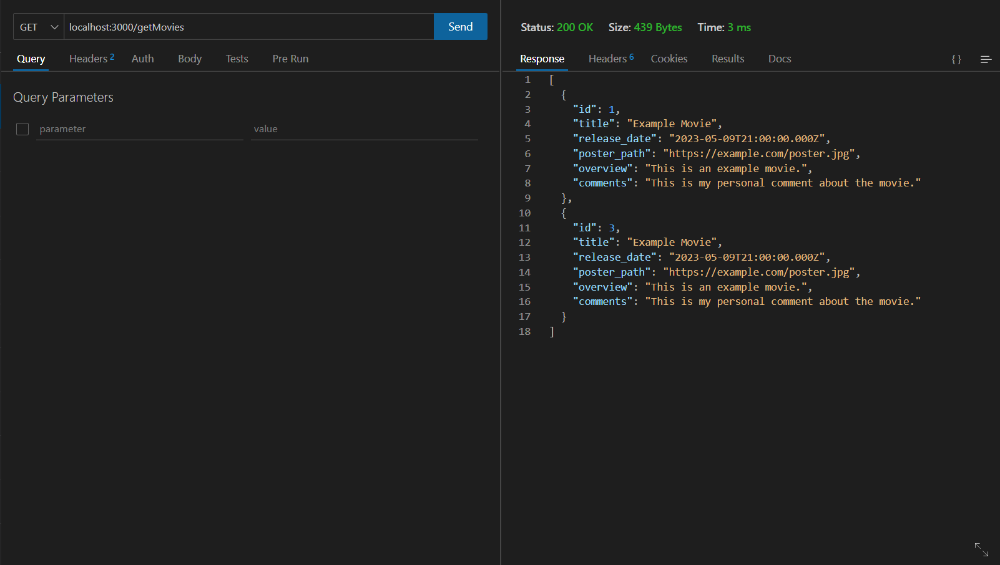
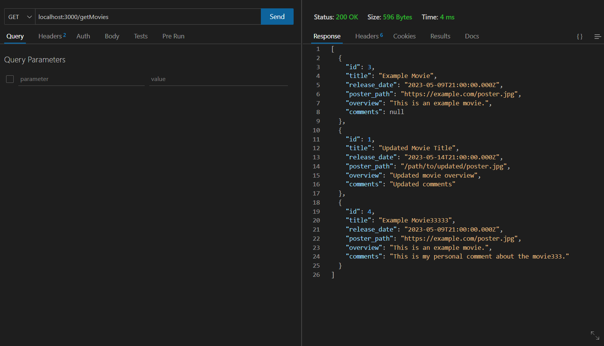
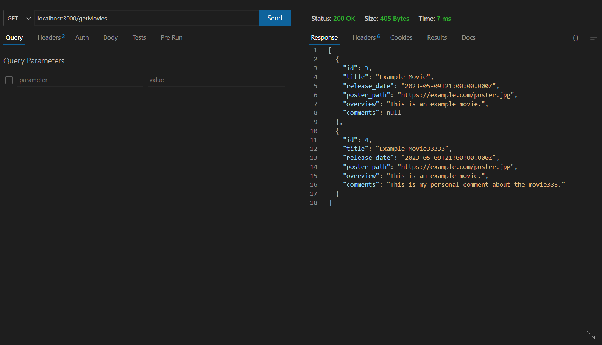
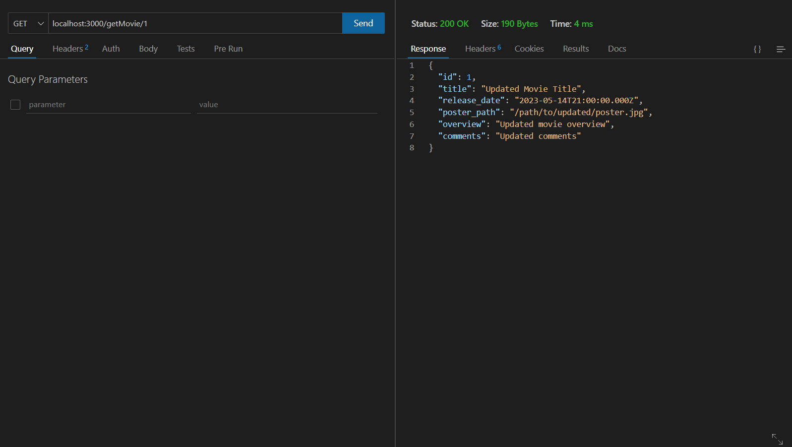

# movies-library v-1.2


**Author Name**: Saleh Al-Mashni

## WRRC


## Overview
This is a simple Node.js server that provides movie data from an external API. It exposes two routes, `/trending` and `/search`, to retrieve trending movies and search for movies by name, respectively.

## Getting Started:

#### To run this application on your own machine, you can follow these steps:

1. Clone this repository or create a new directory for your project and navigate to it using a command line interface.
2. Create a new file called `index.js` and copy the provided code into it.
3. In the command line interface, run `npm init` to create a new `package.json` file for your project.
4. Install the required packages by running `npm install express axios dotenv` in the command line.
5. Create a `.env` file in the root directory of your project and set the following environment variables:
   - `URL` - The base URL of the movie API.
   - `APIKey` - Your API key for accessing the movie API.
   - `PORT` - The port number on which the server will listen (e.g., 3000).
6. Start the application by running `node index.js` in the command line. The console should output a message indicating that the server is listening on the specified port.
7. Open a web browser and navigate to `http://localhost:<port>/trending` or `http://localhost:<port>/search?query=<query>` to access the movie routes.

## Project Features

### Routes

#### GET /trending

Returns a list of trending movies.

To test this route, open a web browser and navigate to `http://localhost:<port>/trending`. You should see a JSON response containing the list of trending movies.




#### GET /search

Query Parameters:
- `query` (required): The search query to find movies by name.

Returns a list of movies that match the search query.

To test this route, open a web browser and navigate to `http://localhost:<port>/search?query=<query>`, replacing `<query>` with the movie name you want to search for. You should see a JSON response containing the list of movies that match the search query.

#### POST /addMovie

Adds a movie to the database along with personal comments.

To test this route, you can use the `curl` command in the command line:

```bash
curl -X POST -H "Content-Type: application/json" -d '{
  "title": "Example Movie",
  "release_date": "2023-05-10",
  "poster_path": "https://example.com/poster.jpg",
  "overview": "This is an example movie.",
  "comments": "This is my personal comment about the movie."
}' http://localhost:<port>/addMovie
```

Make sure to replace <port> with the actual port number on which the server is running. After executing the curl command, you should receive a JSON response containing the added movie details.you should get this message after runnig it:
```bash
{"id":3,"title":"Example Movie","release_date":"2023-05-09T21:00:00.000Z","poster_path":"https://example.com/poster.jpg","overview":"This is an example movie.","comments":"This is my personal comment about the movie."} 
```
Or in the `schema.sql` file by adding
```bash
INSERT INTO movies (title, release_date, poster_path, overview, comments)
VALUES ('Example Movie', '2023-05-10', 'https://example.com/poster.jpg', 'This is an example movie.', 'This is my personal comment about the movie.');
```


#### DELETE /delete/:id

Deletes a specific movie from the database.

To test this route, open a web browser and navigate to `http://localhost:<port>/delete/{movieId}`, replacing `{movieId}` with the ID of the movie you want to delete. You should receive a JSON response indicating whether the deletion was successful or not.
###Before:

###After:



#### GET /getMovie/:id

Returns a specific movie from the database.

To test this route, open a web browser and navigate to `http://localhost:<port>/getMovie/{movieId}`, replacing `{movieId}` with the ID of the movie you want to retrieve. You should see a JSON response containing the details of the specific movie.


#### PUT /update/:id

Updates the comments for a specific movie in the database.

To test this route, you can use the `curl` command in the command line:

```bash
curl -X PUT -H "Content-Type: application/json" -d '{
  "comments": "Updated comments for the movie."
} http://localhost:<port>/update/{movieId}
```


## Error Handling

The server includes basic error handling middleware to handle 404 and 500 errors. If a route is not found, a JSON response with a 404 status code will be returned. If an internal server error occurs, a JSON response with a 500 status code will be returned.

## Database

The server uses a PostgreSQL database to store movie data. The database connection URL should be provided in the `.env` file using the `DATABASE_URL` environment variable. Make sure to set up the database and update the schema using the provided `schema.sql` file before running the server.

