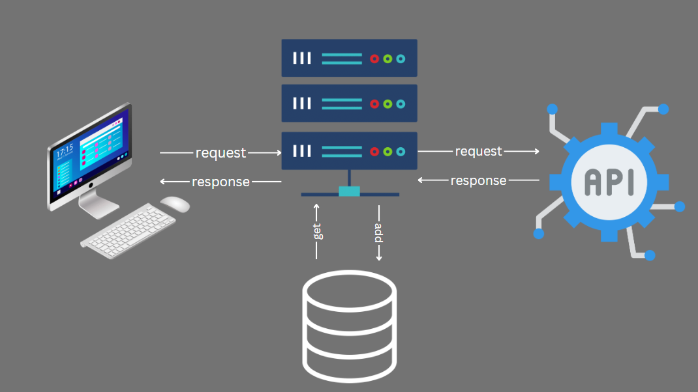

# movies-library v-1.1

**Author Name**: Saleh Al-Mashni

## WRRC

## Overview
This is a simple Node.js server that provides movie data from an external API. It exposes two routes, `/trending` and `/search`, to retrieve trending movies and search for movies by name, respectively.

## Getting Started:

#### To run this application on your own machine, you can follow these steps:

1. Clone this repository or create a new directory for your project and navigate to it using a command line interface.
2. Create a new file called `index.js` and copy the provided code into it.
3. In the command line interface, run `npm init` to create a new `package.json` file for your project.
4. Install the required packages by running `npm install express axios dotenv` in the command line.
5. Create a `.env` file in the root directory of your project and set the following environment variables:
   - `URL` - The base URL of the movie API.
   - `APIKey` - Your API key for accessing the movie API.
6. Start the application by running `node index.js` in the command line. The console should output a message indicating that the server is listening on a specific port.
7. Open a web browser and navigate to `http://localhost:<port>/trending` or `http://localhost:<port>/search?query=<query>` to access the movie routes.
## Project Features
## Routes

### GET /trending

Returns a list of trending movies.

### GET /search

Query Parameters:
- `query` (required): The search query to find movies by name.

Returns a list of movies that match the search query.

## Error Handling

The server includes basic error handling middleware to handle 404 and 500 errors. If a route is not found, a JSON response with a 404 status code will be returned. If an internal server error occurs, a JSON response with a 500 status code will be returned.
